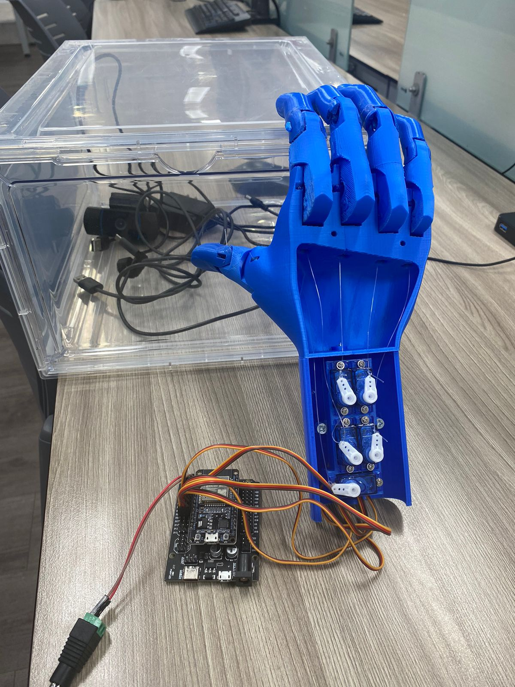

# 🤖 AI-Powered Bionic Hand Control

Este proyecto permite controlar una mano robótica impresa en 3D mediante gestos en tiempo real. Utiliza visión artificial para detectar la posición de los dedos y traduce esos movimientos en comandos para 5 servomotores controlados por un ESP32.



## 🛠️ Cómo funciona
1. **Captura de Movimiento:** Un script de Python procesa el video de la cámara.
2. **Visión Artificial:** Usamos **Mediapipe** para detectar los 21 puntos de referencia (landmarks) de la mano y determinar qué dedos están abiertos o cerrados.
3. **Comunicación Serial:** Python envía una cadena de datos (ej. `1,0,1,1,0`) vía puerto serial al ESP32.
4. **Actuación:** El código de Arduino interpreta los datos y posiciona los **5 servomotores** (uno por dedo) para replicar el movimiento del usuario.

## 🏗️ Hardware
* **Cerebro:** ESP32 (o NodeMCU-32S).
* **Actuadores:** 5 Servomotores (uno para cada dedo).
* **Estructura:** Mano robótica impresa en 3D.
* **Conexión:** Cable USB para comunicación Serial.

## 💻 Software y Librerías
### Python
* `opencv-python`: Para la captura de video.
* `mediapipe`: Para el modelo de IA de detección de manos.
* `pyserial`: Para enviar los datos al microcontrolador.

### Arduino/C++
* `ESP32Servo`: Para el control preciso de los servomotores en el ESP32.

## 📂 Estructura del Repositorio
* `/python`: Contiene el script de reconocimiento de gestos y lógica de IA.
* `/arduino`: Código `.ino` para el control de los servos y recepción serial.

## 🚀 Instalación y Uso

1. **Cargar el código al ESP32:**
   Abre el archivo en `/arduino`, instala la librería `ESP32Servo` y súbelo a tu placa.

2. **Configurar Python:**
   ```bash
   pip install opencv-python mediapipe pyserial
